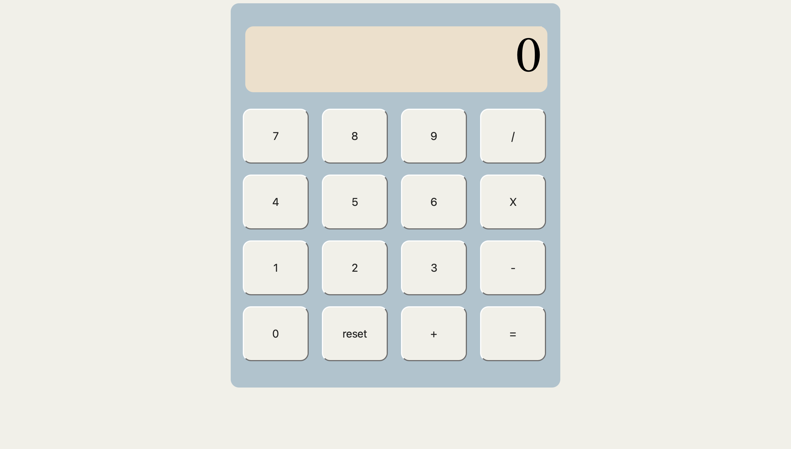

# Calculator

A simple web-based calculator built using HTML, CSS, and JavaScript.

## Features

- Perform basic arithmetic operations: addition, subtraction,  multiplication, and division.
- Clear button to reset the calculator.
- User-friendly interface for easy calculations.

## Usage

Follow these steps to use the calculator:

1. Clone this repository to your local machine or download the ZIP file.

2. Open the `calculator.html` file in your web browser.

3. Start performing calculations!

## Screenshot

## Technologies Used

- HTML
- CSS
- JavaScript

## Author

- Sydney Quach